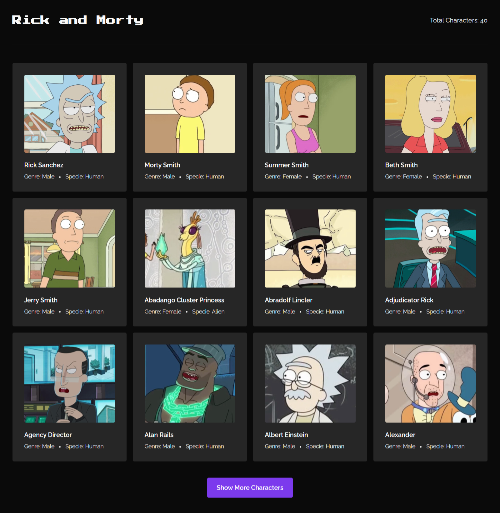

# Rick and Morty API

Este projeto é uma aplicação web que utiliza a API pública do Rick and Morty, permitindo consultar e visualizar informações sobre todos os personagens que já apareceram na série de animação "Rick and Morty".

## Tecnologias Utilizadas
- HTML
- CSS
- React.js

## Dê play no projeto!

[Confira aqui!](https://iana-ribeiro.github.io/rick-and-morty-api/)

## Contato

**E-mail**: ianaribeiro.tech@gmail.com

Ou entre em contato pelo [LinkedIn](https://www.linkedin.com/in/iana-ribeiro/).
